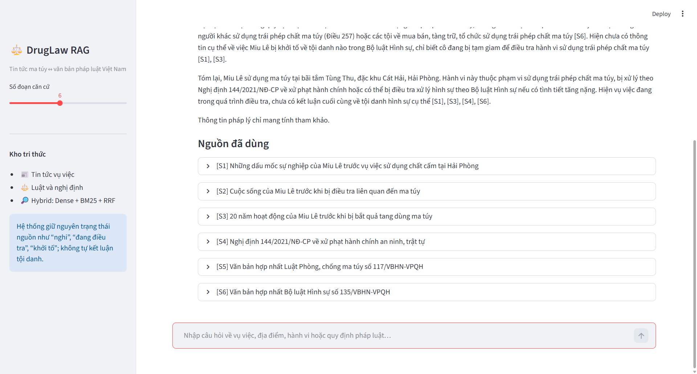
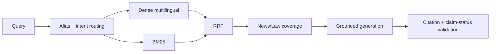

# DrugLaw RAG — Day 08 L3B

Chatbot hỏi đáp tiếng Việt nối **tin tức vụ việc ma túy** với **văn bản pháp luật**. Hệ thống được thiết kế cho câu hỏi nhiều bước như:

> Miu Lê sử dụng ma túy ở đâu và hành vi này bị xử lý theo quy định nào?

Hệ thống giữ nguyên mức độ chắc chắn của nguồn, phân biệt *nghi vấn*, *đang điều tra*, *khởi tố* và *kết án*. Với cá nhân có tên thật, câu trả lời chỉ được sinh khi retrieval lấy được ít nhất hai nguồn tin độc lập.



## Corpus

- 3 văn bản từ Cổng Thông tin điện tử Chính phủ:
  - Văn bản hợp nhất Luật Phòng, chống ma túy 117/VBHN-VPQH.
  - Văn bản hợp nhất Bộ luật Hình sự 135/VBHN-VPQH.
  - Nghị định 144/2021/NĐ-CP, trong đó Điều 23 quy định xử phạt hành vi sử dụng trái phép chất ma túy.
- 8 bài tin từ VTV, Báo Chính phủ, VnExpress và Thanh Niên.
- `data/sources.csv` lưu URL, nguồn, checksum, ngày crawl và phương pháp trích xuất.

Chạy lại dữ liệu:

```bash
python -m src.task1_collect_legal_docs
python -m src.task2_crawl_news
python -m src.task3_convert_markdown
```

## Pipeline



- **Chunking:** Markdown/legal-aware recursive splitter, `850` ký tự, overlap `120`.
- **Embedding:** `paraphrase-multilingual-MiniLM-L12-v2`, vector chuẩn hóa.
- **Dense store:** ChromaDB cosine, ID ổn định và upsert không nhân bản.
- **Lexical:** BM25 tự triển khai, hỗ trợ tên riêng, mã điều luật và số văn bản.
- **Fusion:** RRF đúng một lần trên mỗi nhánh truy xuất.
- **Cross-KB planner:** câu hỏi vừa có vụ việc vừa có pháp luật được tách thành event subquery và law subquery; top-k phải có cả News và Law.
- **Fallback:** dùng cosine score gốc; lỗi provider không làm giao diện crash.
- **Generation:** citation `[S1]`, `[S2]`; từ chối khi thiếu căn cứ hoặc thiếu hai nguồn độc lập cho người có tên thật.

## Cài đặt và chạy

```powershell
python -m venv .venv
.venv\Scripts\Activate.ps1
python -m pip install --upgrade pip setuptools wheel
python -m pip install -e ".[dev]"
Copy-Item .env.example .env
python -m src.task4_chunking_indexing
streamlit run app.py
```

Không commit `.env` hoặc API key. Nếu không có LLM key, pipeline dùng generator trích xuất có citation để vẫn demo được hành vi an toàn.

PageIndex là fallback tùy chọn. Sau khi tự điền `PAGEINDEX_API_KEY` vào `.env`, upload ba PDF legal một lần bằng:

```powershell
python -m src.task8_pageindex_vectorless
```

Document ID được lưu trong `pageindex_doc_ids.json` ở máy local và đã bị chặn bởi `.gitignore`. Nếu không có key, cache chưa được tạo hoặc provider lỗi/timeout, retrieval tự rơi về kết quả hybrid thay vì làm UI crash.

## Evaluation

Golden dataset có 18 câu bám corpus. Config A là dense-only; Config B là query planning + Dense + BM25 + RRF + News/Law coverage. Generator và `top_k=6` được giữ nguyên.

```bash
python scripts/evaluate_pipeline.py
pytest tests/test_contracts.py -q
pytest tests/test_acceptance.py -q
pytest -q
```

Kết quả baseline hiện tại:

| Metric | Dense-only | Hybrid | Delta |
|---|---:|---:|---:|
| Faithfulness proxy | 1.000 | 1.000 | +0.000 |
| Answer relevance proxy | 0.474 | 0.493 | +0.018 |
| Context recall | 0.500 | 1.000 | +0.500 |
| Context precision | 0.343 | 0.630 | +0.287 |

Chi tiết từng case và ba lỗi kém nhất nằm trong `group_project/evaluation/RESULT.md` và `retrieval_results.json`.

## Báo cáo thành viên

- Phân công nhóm: `TEAMMATES.md`.
- Báo cáo cá nhân: `reports/`.
- Handoff Data & Provenance cho Dương Thị Ngân (`2A2026022808`): `NGAN_HANDOFF.md`.

## Giới hạn

- Đây là hệ thống hỗ trợ tra cứu, không thay thế tư vấn pháp lý hoặc kết luận của cơ quan có thẩm quyền.
- Tin tức có thể được cập nhật sau thời điểm crawl; cần chạy lại ingestion trước demo nếu nguồn thay đổi.
- Bản đánh giá hiện dùng metric proxy cục bộ để tái lập; trước khi nộp nên chạy thêm một lượt LLM judge và ghi rõ model/version.
